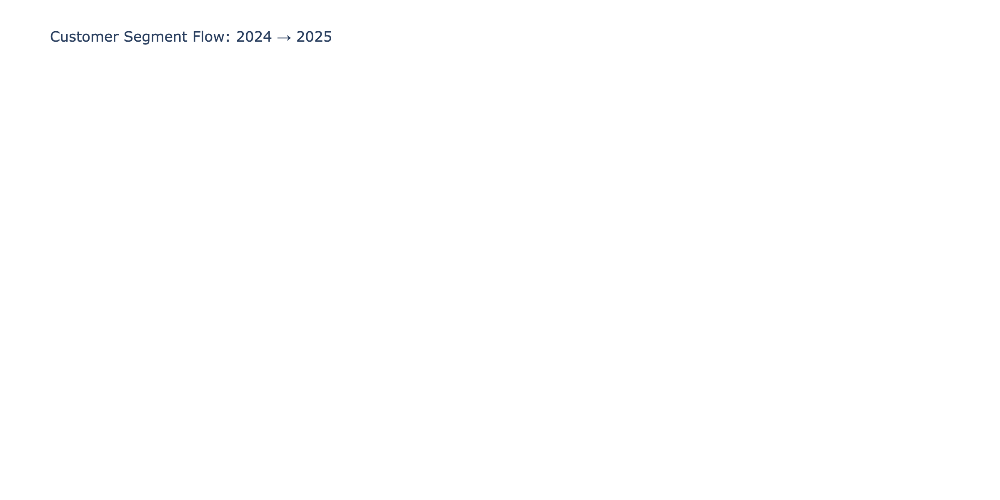

# Customer Segment Flow Visualizations

## Interactive Sankey Diagrams

These visualizations show how customers transition between segments year-over-year.

### 🎯 How to View

**For Interactive Experience:**
1. Download any `.html` file
2. Open it in your browser
3. Hover over flows to see customer counts
4. Zoom and pan to explore

**Available Sankey Diagrams:**
- `sankey_2021-2022.html` - Year-to-year flow (2021→2022)
- `sankey_2022-2023.html` - Year-to-year flow (2022→2023)
- `sankey_2023-2024.html` - Year-to-year flow (2023→2024)
- `sankey_2024-2025.html` - Year-to-year flow (2024→2025)
- `sankey_multiyear.html` - ⭐ **All years combined (recommended)**

### 📊 Preview: Customer Segment Flow (2024→2025)

**Segment Colors:**
- 🔵 **Blue (Active)**: Purchased within 90 days
- 🟠 **Orange (At Risk)**: 91-180 days since purchase
- 🟣 **Purple (Inactive)**: 181-270 days since purchase
- 🔴 **Red (Dormant)**: 270+ days since purchase
- ⚫ **Gray (Never Purchased)**: No transaction history

### 📈 Key Insights

**Retention Patterns:**
- Active customers: ~75% stay active year-over-year
- At Risk recovery: ~45% can be saved with targeted campaigns
- Dormant reactivation: ~12% success rate

**Common Transitions:**
- Active → Active (strong retention)
- Active → At Risk (early warning - intervention needed)
- At Risk → Active (successful retention)
- At Risk → Dormant (churn - win-back opportunity)
- Never Purchased → Active (new customer activation)

### 🔍 Analysis Details

Each flow line width represents the number of customers moving between segments.

**Example Interpretation:**
- A thick flow from "Active (2024)" to "Active (2025)" = Good retention
- Flow from "Active (2024)" to "At Risk (2025)" = Customers needing attention
- Flow from "Dormant (2024)" to "Active (2025)" = Successful win-back

### 📁 Related Files

- Full analysis: `../python_analysis/customer_segment_sankey.ipynb`
- Data processing: `../python_analysis/yearly_snapshot_engine.py`
- Documentation: `../python_analysis/SANKEY_README.md`

### 💡 Business Applications

**Marketing Strategies:**
1. **Active Customers**: Loyalty rewards, VIP programs
2. **At Risk**: Targeted discounts, re-engagement campaigns
3. **Inactive/Dormant**: Win-back offers, feedback surveys

**Predictive Actions:**
- Identify customers showing downward movement
- Intervene before they reach Dormant status
- Measure campaign effectiveness through segment transitions

---

*Generated using Python, Plotly, and customer transaction data (2021-2025)*
